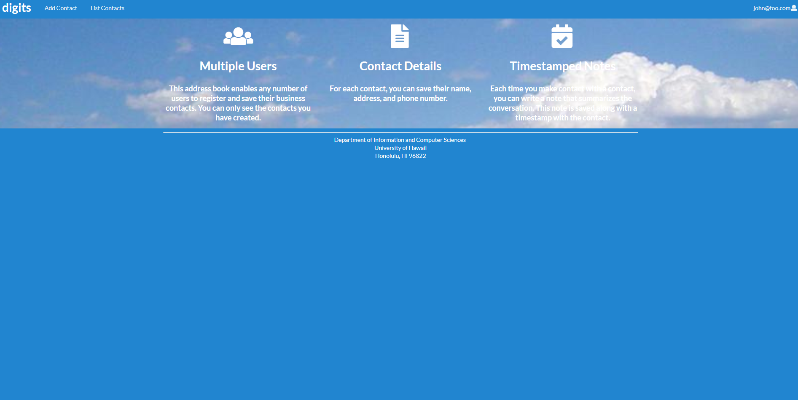
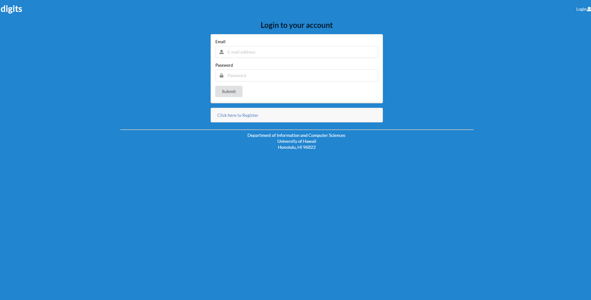
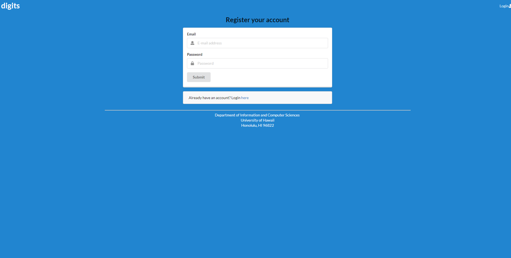
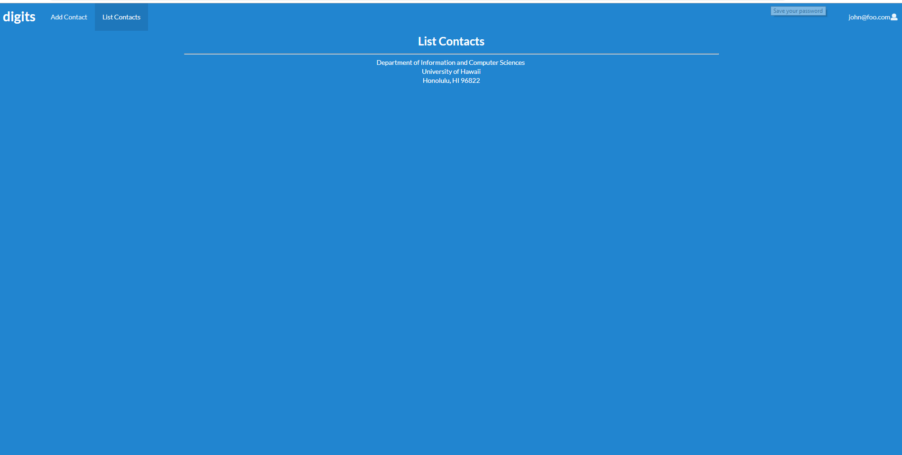
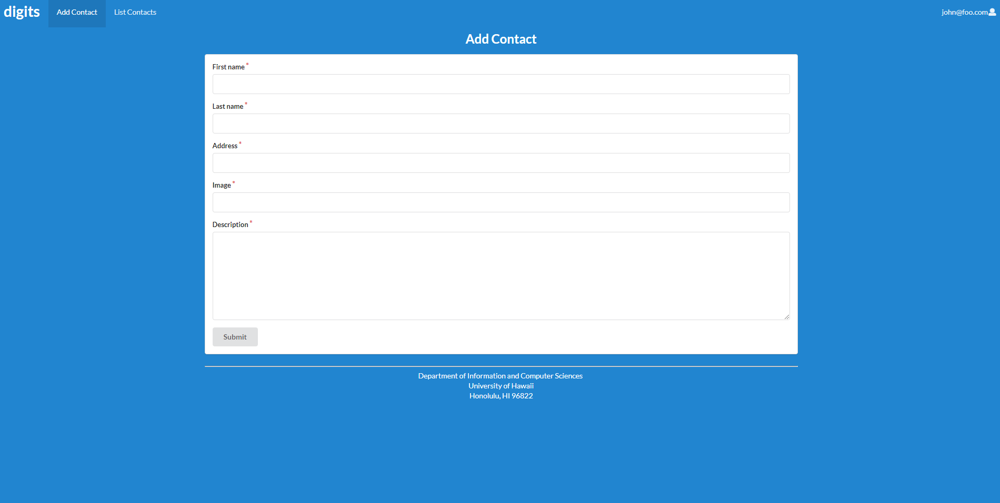
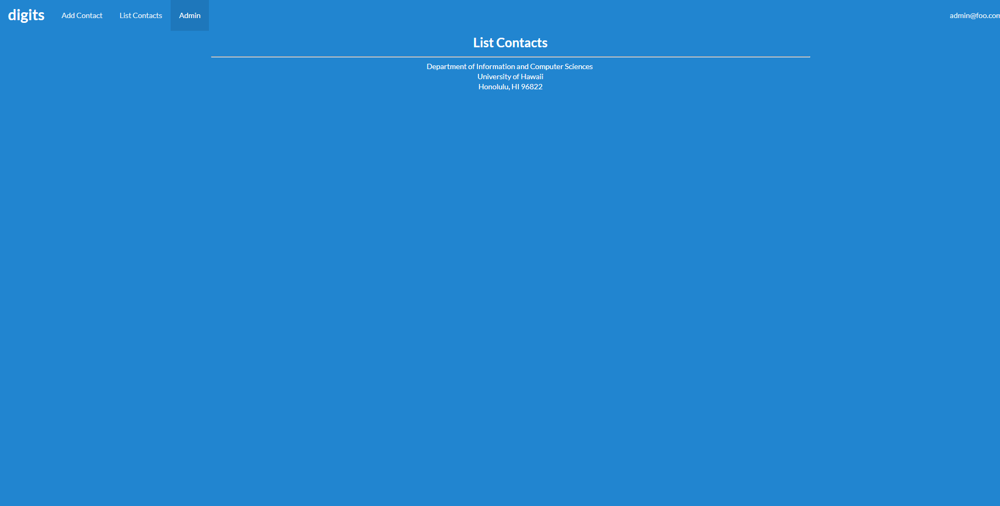

The application digits allows users to:

1. Register an account on the webage.

2. Create, edit, and delete contacts.

3. Add notes to the bottom of each contact with a timestamp. 

<h3>Installation</h3>

 First, install <a href="https://www.meteor.com/install">Meteor</a>

Second download a copy of <a href="https://github.com/kylemo94/digits">digits</a> . Digits is a private repo and you will need to request permission from the author.

Third, using the command prompt or terminal, you will cd into the app directory and install the required libraries using $ meteor npm install (for mac users) and meteor npm install (for windows users).

When the libraries are finished installing you can run the app using $ meteor npm run start (for mac users) and meteor npm run start (for windows users).

The first time the app is run, the default users and associated data will be created.

<h3>Bcrypt warning</h3>

A bcrypt warning wil show up when the app is run.

On some operating systems (particularly Windows), installing bcrypt is much more difficult than implied by the above message. Bcrypt is only used in Meteor for password checking, so the performance implications are negligible until your site has very high traffic. You can safely ignore this warning without any problems during initial stages of development.

You can check to see your running application at <a href="http://localhost:3000">http://localhost:3000</a>

ESLint can be run on the imports/ directory code using meteor npm run lint.

<h3>User Interface Walkthrough</h3>
<h4>Landing Page</h4>

The first page that is shown will be the landing page, which contains brief information on what the digits application does.

<h4>SignIn/Register</h4>

Pressing the login button will have a Sign In option or a Sign Up option. You can choose the option that applies to you.

<h4>SignIn</h4>

Clicking on the SignIn option will bring you to a login page shown below.

<h4>SingUp</h4>

Clicking on the SignUp option will bring you to a register page shown below.

<h4>Homepage</h4>

Clicking on the digits logo will bring you to the homepage

<h4>ListContacts</h4>

Clicking on the ListContacts button will bring you to the current contacts in the database of the user. Timestamped notes can also be added here.

<h4>Edit Contacts</h4>

Clicking on the edit button on the ListContacts page will bring you to a page to edit the current contact.

<h4>AddContact</h4>

Clicking on the AddContact button will bring you to a form to add a new contact.

<h4>Admin</h4>

The admin title is currently given to one user located in the settings.development.json file. More admins can be designated in this file. The admin has the ability to see all contacts of all users. 

